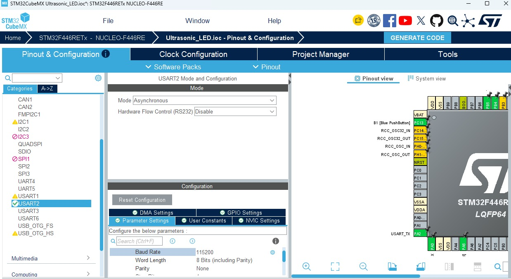
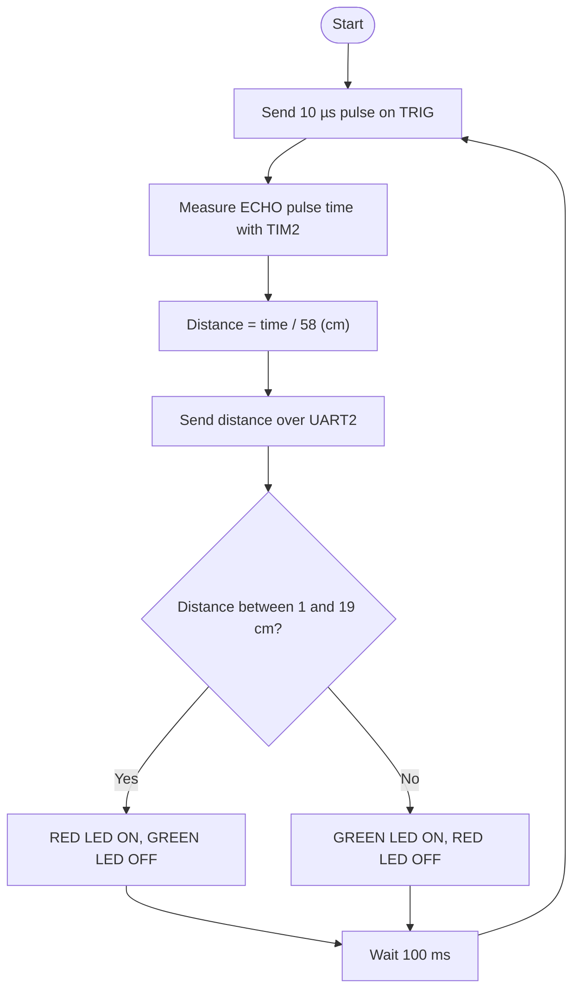
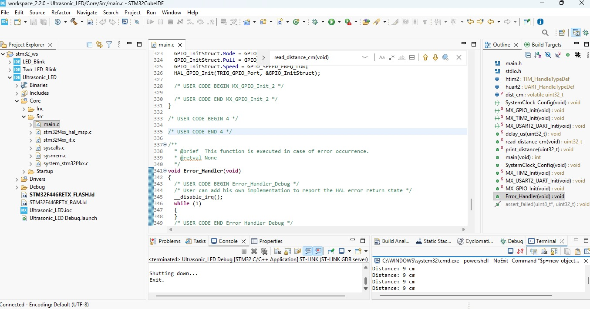
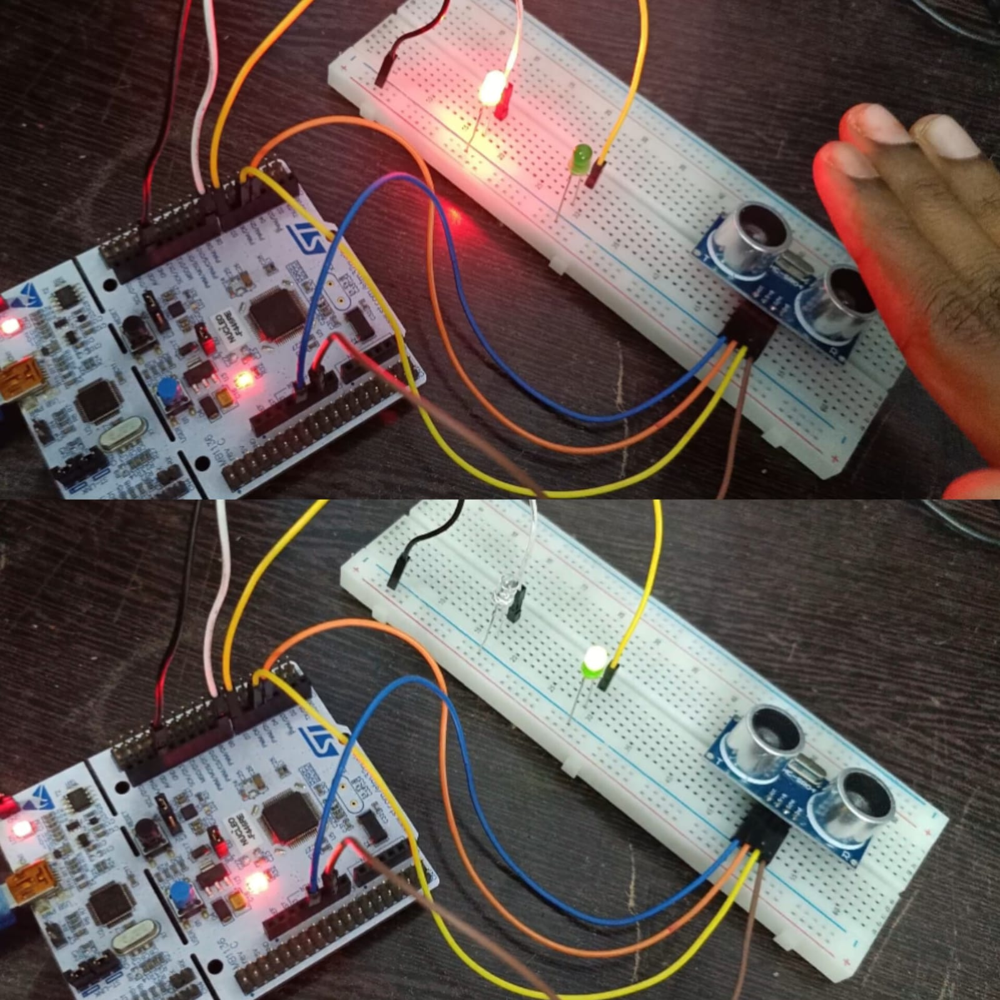

# STM32 NUCLEO-F446RE LED Blink with Ultrasonic Sensor

## Project Overview

This project measures distance with an **HC-SR04 ultrasonic sensor** on the **STM32 NUCLEO-F446RE** board and shows it in two ways:

- **LEDs:** the **red LED** glows when an object is closer than **20 cm**, and the **green LED** glows when the object is farther away or nothing is detected.
- **Serial output:** the distance in cm is sent over **UART2** to the PC and read in a PowerShell terminal opened inside STM32CubeIDE.

The echo time is measured with the hardware timer **TIM2**, counting in microseconds. The project was created with **STM32CubeMX** and built, flashed and run with **STM32CubeIDE 2.2.0**.

## Key Features

- STM32 NUCLEO-F446RE board
- HC-SR04 ultrasonic distance measurement
- Microsecond timing using TIM2
- GPIO output (Trig, LEDs) and GPIO input (Echo)
- UART2 serial output through the on-board ST-LINK virtual COM port
- Distance reading in a PowerShell terminal inside STM32CubeIDE
- Red / green LED indication based on distance
- STM32 HAL library
- Programming and debugging through the on-board ST-LINK

## Hardware Required

| Component | Quantity |
| --------- | -------- |
| STM32 NUCLEO-F446RE board | 1 |
| HC-SR04 ultrasonic sensor | 1 |
| Green LED | 1 |
| Red LED | 1 |
| Resistors for the Echo voltage divider (1 kΩ and 2 kΩ) | 1 each |
| Breadboard | 1 |
| Jumper wires | As required |
| USB cable (data cable) | 1 |

## Pin Configuration

| Signal | MCU Pin | Arduino Pin | Mode |
| ------ | ------- | ----------- | ---- |
| TRIG | PB5 | D4 | GPIO_Output |
| ECHO | PB4 | D5 | GPIO_Input |
| GREEN_LED | PA8 | D7 | GPIO_Output |
| RED_LED | PA9 | D8 | GPIO_Output |
| USART2_TX | PA2 | (ST-LINK virtual COM port) | Alternate function |
| USART2_RX | PA3 | (ST-LINK virtual COM port) | Alternate function |

## Wiring

| Component | Connection |
| --------- | ---------- |
| HC-SR04 VCC | 5V |
| HC-SR04 GND | GND |
| HC-SR04 Trig | D4 (PB5) |
| HC-SR04 Echo | Voltage divider (1 kΩ + 2 kΩ), then D5 (PB4) |
| Green LED long leg (+) | D7 (PA8) |
| Red LED long leg (+) | D8 (PA9) |
| Both LED short legs (-) | GND |

The Echo pin of the HC-SR04 outputs 5 V, so a voltage divider brings it down to about 3.3 V for the STM32 pin.

## STM32CubeMX Configuration

### Pinout and Configuration (UART2)

1. Create a new project and select the **NUCLEO-F446RE** board in the Board Selector.
2. Initialize all peripherals with their default mode. This enables **USART2** on PA2 and PA3 for the ST-LINK virtual COM port.
3. Set **PB5** to `GPIO_Output` with the label `TRIG`.
4. Set **PB4** to `GPIO_Input` with the label `ECHO`.
5. Set **PA8** and **PA9** to `GPIO_Output` with the labels `GREEN_LED` and `RED_LED`.
6. Open **Connectivity → USART2** and check the mode is **Asynchronous** with a baud rate of **115200**, 8 data bits, no parity, 1 stop bit.
7. Open **Timers → TIM2** and set the following:

| TIM2 Setting | Value |
| ------------ | ----- |
| Clock Source | Internal Clock |
| Prescaler (PSC) | 83 |
| Counter Mode | Up |
| Counter Period (ARR) | 4294967295 |

The timer clock is 84 MHz, so a prescaler of 83 makes the timer count once every **1 µs**.





### Project Manager

| Setting | Value |
| ------- | ----- |
| Project Location | the parent folder (for example C:\stm32_ws) |
| Toolchain / IDE | STM32CubeIDE |

Then click **Generate Code** and **Open Project**.

## Working Principle

The HC-SR04 measures distance with sound:

1. The board sets **TRIG** HIGH for **10 µs**.
2. The sensor sends out an ultrasonic burst and then raises **ECHO** HIGH.
3. **ECHO** stays HIGH for as long as the sound takes to travel to the object and back.
4. TIM2 measures that time in microseconds.
5. Distance is calculated as:

```
Distance (cm) = Echo time (µs) / 58
```

If no echo returns within 30 ms, the distance is reported as **0**.

## Project Working Diagram



### LED Behaviour Based on Distance

| Distance | Green LED (D7) | Red LED (D8) |
| -------- | -------------- | ------------ |
| Below 20 cm (object close) | ⚫ OFF | 🔴 ON |
| 20 cm or more (object far) | 🟢 ON | ⚫ OFF |
| No echo (distance 0) | 🟢 ON | ⚫ OFF |

```
   Object far (20 cm or more)          Object close (below 20 cm)

   [Sensor] ))))        [Object]       [Sensor] ))) [Object]
      🟢 Green ON                         🔴 Red ON
```

## Code

The code is added in `Core/Src/main.c`, inside the `USER CODE` sections.

```c
/* USER CODE BEGIN Includes */
#include <stdio.h>
/* USER CODE END Includes */
```

```c
/* USER CODE BEGIN 0 */
static void delay_us(uint32_t us)
{
  __HAL_TIM_SET_COUNTER(&htim2, 0);
  while (__HAL_TIM_GET_COUNTER(&htim2) < us);
}

static uint32_t read_distance_cm(void)
{
  // 10 microsecond trigger pulse
  HAL_GPIO_WritePin(TRIG_GPIO_Port, TRIG_Pin, GPIO_PIN_SET);
  delay_us(10);
  HAL_GPIO_WritePin(TRIG_GPIO_Port, TRIG_Pin, GPIO_PIN_RESET);

  // wait for echo to go high (30 ms timeout)
  __HAL_TIM_SET_COUNTER(&htim2, 0);
  while (HAL_GPIO_ReadPin(ECHO_GPIO_Port, ECHO_Pin) == GPIO_PIN_RESET)
    if (__HAL_TIM_GET_COUNTER(&htim2) > 30000) return 0;

  // time how long echo stays high (30 ms timeout)
  __HAL_TIM_SET_COUNTER(&htim2, 0);
  while (HAL_GPIO_ReadPin(ECHO_GPIO_Port, ECHO_Pin) == GPIO_PIN_SET)
    if (__HAL_TIM_GET_COUNTER(&htim2) > 30000) return 0;

  return __HAL_TIM_GET_COUNTER(&htim2) / 58;   // microseconds to cm
}
/* USER CODE END 0 */
```

```c
/* USER CODE BEGIN 2 */
HAL_TIM_Base_Start(&htim2);
/* USER CODE END 2 */
```

```c
/* USER CODE BEGIN 3 */
uint32_t d = read_distance_cm();

char msg[40];
int len = sprintf(msg, "Distance: %lu cm\r\n", d);
HAL_UART_Transmit(&huart2, (uint8_t *)msg, len, 100);

if (d > 0 && d < 20) {        // object close
  HAL_GPIO_WritePin(RED_LED_GPIO_Port, RED_LED_Pin, GPIO_PIN_SET);
  HAL_GPIO_WritePin(GREEN_LED_GPIO_Port, GREEN_LED_Pin, GPIO_PIN_RESET);
} else {                      // far away or no echo
  HAL_GPIO_WritePin(GREEN_LED_GPIO_Port, GREEN_LED_Pin, GPIO_PIN_SET);
  HAL_GPIO_WritePin(RED_LED_GPIO_Port, RED_LED_Pin, GPIO_PIN_RESET);
}
HAL_Delay(100);
/* USER CODE END 3 */
```

## How to Open the Terminal and Read the Distance

The distance is sent through UART2 and the ST-LINK virtual COM port, so no extra hardware is needed.

**Step 1: Run the program.** Click **Run** in STM32CubeIDE and wait until flashing finishes. Make sure no Debug session is open (stop it with the red square), and that no other program is using the COM port.

**Step 2: Open a terminal inside STM32CubeIDE.**
1. Go to `Window → Show View → Other...`.
2. Choose `Terminal → Terminal` and click **Open**.
3. In the Terminal tab at the bottom, click the **Open a Terminal** icon.
4. Set the terminal type to **Local Terminal** and click **OK**.
5. A black command prompt appears (for example `C:\Users\name>`).

**Step 3: Paste the command.** Click inside the black prompt, paste the following command on **one line**, and press Enter:

```powershell
powershell -NoExit -Command "$p=new-object System.IO.Ports.SerialPort COM26,115200,None,8,one; $p.Open(); while($true){$p.ReadLine()}"
```

| Part of the command | Meaning |
| ------------------- | ------- |
| `COM26` | The COM port of the board (check yours in Device Manager) |
| `115200` | Baud rate, matching the USART2 setting |
| `None,8,one` | No parity, 8 data bits, 1 stop bit |

**Step 4: Read the output.** New lines appear continuously:

```
Distance: 23 cm
Distance: 22 cm
Distance: 8 cm
Distance: 9 cm
```

The numbers change as you move your hand in front of the sensor.





**To stop reading:** click inside the terminal and press `Ctrl+C`, type `exit` and press Enter, then close the terminal tab. This frees the COM port, so the next flash does not fail with "Access denied".

**If something goes wrong:**

| Message | Fix |
| ------- | --- |
| `'26' is not recognized` | The command was split into several lines. Paste it again on one line. |
| Access to the path 'COM26' is denied | Another program is using the port. Close it and try again. |
| The port 'COM26' does not exist | Unplug and replug the USB cable, then check the COM number in Device Manager. |
| Nothing prints | Press the black RESET button on the board. |

## Output

The red LED glows when an object is closer than 20 cm, and the green LED glows when it is farther away.





## Demonstration Video

[▶️ Watch the Ultrasonic Sensor LED Demonstration](https://drive.google.com/file/d/18b2NfphzFTHdPAAgg8hwhPHQLNqQzgqL/view?usp=drivesdk)

## How to Run

1. Wire the sensor and LEDs as shown above.
2. Open **STM32CubeIDE**.
3. Go to `File → Import → General → Existing Projects into Workspace`.
4. Select the project folder and click **Finish**.
5. Build the project with the hammer icon.
6. Connect the board with a USB cable.
7. Click **Run** and accept the default debug configuration.
8. Open the terminal and paste the PowerShell command to see the distance values.

## Testing

| Test | Result |
| ---- | ------ |
| Build | 0 errors, 0 warnings |
| Flash through ST-LINK | Successful |
| Object closer than 20 cm | Red LED ON |
| Object farther than 20 cm | Green LED ON |
| Serial output | Distance printed in cm |

## Important Notes

### COM Port

The COM number (here COM26) can change if you plug the board into a different USB port. Check Device Manager and edit the command.

### Free the Port Before Flashing

Close the PowerShell terminal before you click Run again. If it stays open, flashing can fail with "Access denied".

### Distance 0

A reading of `0` means no echo was received within 30 ms. This happens when the object is too far, too close (under about 2 cm), or the wiring is wrong.

### Echo Voltage

The Echo signal is 5 V. A voltage divider on the Echo line protects the 3.3 V STM32 pin.

### Jumpers

Both **CN2** jumper caps on the board must be fitted. If they are missing, the debugger shows:

```
Error in initializing ST-LINK device.
Reason: No device found on target.
```

### Code Placement

Write your own code only between the `USER CODE BEGIN` and `USER CODE END` comments. Anything outside them is erased when the code is regenerated.

## Technologies and Concepts

- STM32 NUCLEO-F446RE
- STM32CubeIDE 2.2.0
- STM32CubeMX
- STM32 HAL library
- HC-SR04 ultrasonic sensor
- GPIO input and output
- TIM2 as a microsecond counter
- UART2 and the ST-LINK virtual COM port
- PowerShell serial reading
- ST-LINK programming and debugging

## Future Improvements

- Show the distance on a 16×2 I2C LCD
- Add a buzzer that beeps faster as the object gets closer
- Use timer input capture instead of polling for the Echo pin
- Push button to change the distance limit
